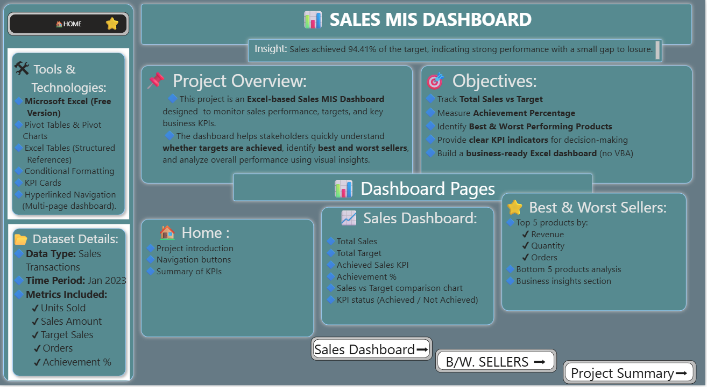
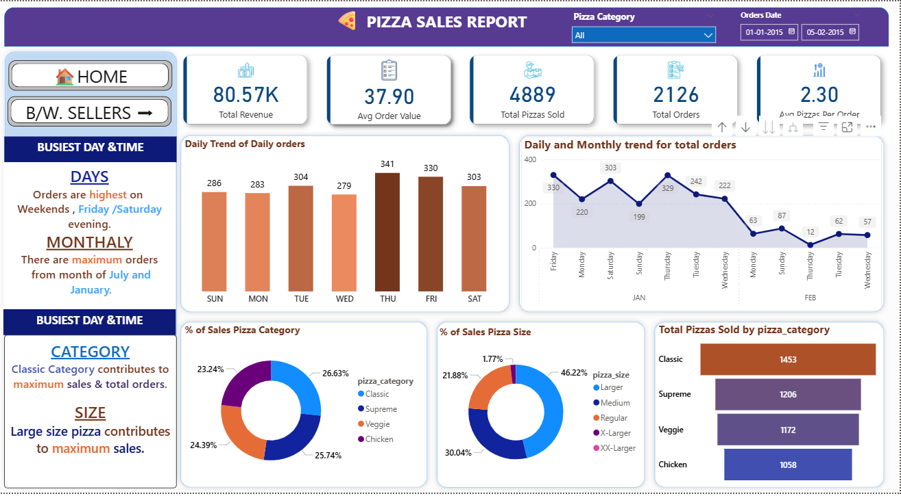
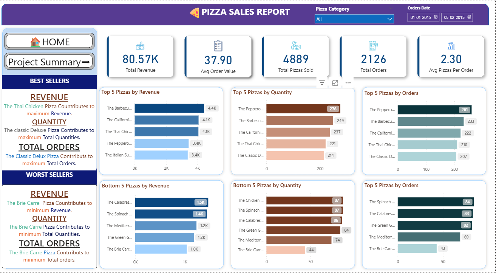
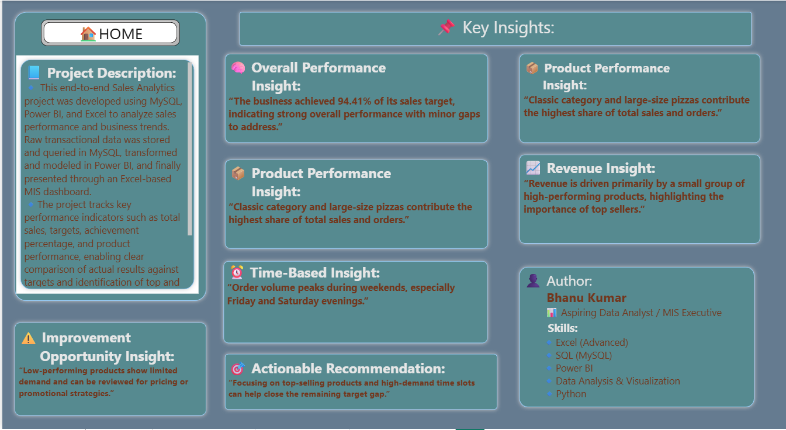

# 📊 Sales MIS Dashboard

An end-to-end **Sales MIS Dashboard** built using **MySQL, Power BI, and Excel** to track KPIs, analyze best & worst sellers, and generate actionable business insights.

---

## 🚀 Project Overview
This project analyzes sales transaction data to monitor:
- Total Sales vs Target
- Achievement Percentage
- Best & Worst Performing Products
- Time-based sales trends
- Category & size-level performance

The solution follows a complete analytics pipeline:
**MySQL → Power BI → Excel Dashboard**

---

## 🛠 Tools & Technologies
- **MySQL** – Data storage & querying  
- **Power BI** – Data modeling & transformation  
- **Microsoft Excel (Free Version)** – Dashboard & KPI visualization  
- **Pivot Tables & Charts**
- **Conditional Formatting**
- **Multi-page Navigation**

---

## 🧭 Dashboard Pages

### 🏠 Home / Overview

---

### 📈 Sales Dashboard

---

### ⭐ Best & Worst Sellers

---

### 🧠 Project Summary & Insights

---

## 🔍 Key Insights
- Sales achieved **94.41%** of the target, showing strong performance with a small gap to closure.
- **Classic category** and **Large size pizzas** contribute the highest share of revenue and orders.
- Orders peak during **weekends**, especially **Friday and Saturday evenings**.
- A small set of top-performing products drives the majority of revenue.
- Low-performing products present opportunities for pricing or promotional optimization.

---

## 👤 Author
**Bhanu Kumar**  
📌 Aspiring Data Analyst / MIS Executive  

**Skills:**  
- Excel (Advanced)  
- SQL (MySQL)  
- Power BI  
- Data Analysis & Visualization  
- Python  

---

## 🔗 Project Status
✅ Completed  
📁 Portfolio-ready  
🌐 Hosted via GitHub Pages
